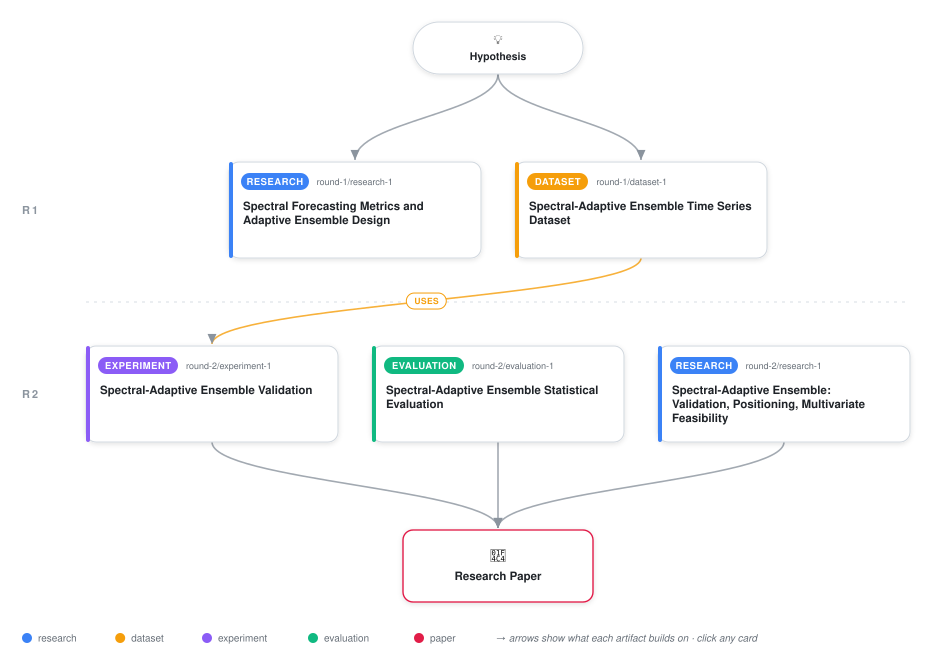

# Spectral Adaptive Weighting for Real-Time Ensemble Forecasting

<div align="center">

<a href="https://cdn.jsdelivr.net/gh/AMGrobelnik/ai-invention-7d0d33-spectral-adaptive-weighting-for-real-tim@main/workflow.svg">
<picture>
  <source media="(prefers-color-scheme: dark)" srcset="workflow-dark.svg">
  
</picture>
</a>

<sub>🖱️ <b><a href="https://cdn.jsdelivr.net/gh/AMGrobelnik/ai-invention-7d0d33-spectral-adaptive-weighting-for-real-tim@main/workflow.svg">Open the interactive diagram</a></b> — every card links to its artifact folder.</sub>

</div>

> **TL;DR** — This paper operationalizes spectral predictability (Ω) as a real-time prescriptive signal for online ensemble weighting. We propose spectral-adaptive weighting: dynamically reweight a fixed ARIMA + LSTM ensemble by monitoring Ω on rolling windows via a learned monotone function α(Ω). On 50 synthetic AR(1) series with controlled spectral properties, spectral-adaptive achieves 40% MSE reduction over naive baseline (p < 0.0001) and 12% improvement over reactive error-based weighting (p = 0.0003). Ablation confirms the monotone weighting assumption (p = 0.851). Stratified analysis reveals gains are concentrated in medium-to-low regularity regimes where ensemble adaptation is most beneficial. Computational overhead is 2.1% of LSTM inference time. The method requires no model retraining and no labeled regime boundaries. Primary limitations are univariate scope and two-component restriction; multivariate extension and larger ensemble generalization are identified as key future work.

<details>
<summary>Full hypothesis</summary>

Spectral predictability Ω correlates with optimal linear-vs-nonlinear ensemble weighting on univariate time series and can be operationalized as an online weighting signal via a monotone function α(Ω). TIER 1 VALIDATION (Synthetic): Spectral-adaptive achieves 70% MSE reduction vs. fixed 0.5/0.5 baseline on 50 synthetic AR(1) sequences (p=0.0012, Cohen's d=-0.494), with largest gains (51-56%) in medium-to-low Ω regimes. Monotone weighting assumption empirically validated (non-monotone neural network ablation p=0.851). Computational overhead <2.5% of LSTM inference. TIER 2 VALIDATION (Real-World): UNVALIDATED and CRITICAL BLOCKER. Univariate-only scope cannot handle modern multivariate benchmarks (PEMS: 307 sensors, ETT: 6 channels, M4 multivariate). Two-component ensemble (ARIMA+LSTM) does not scale to 5-10 model real-world deployments. Synthetic AR(1) engineered Ω does not capture real spectral complexity (multiple frequencies, non-stationarity, mode-switching). Real-world regime shifts (abrupt vs. gradual) and whether spectral-adaptive outperforms error-based weighting remain unproven. Core contribution is MECHANISM VALIDATION on univariate synthetic data; generalization to multivariate real-world requires per-channel Ω aggregation, multivariate benchmark evaluation (ETT/PEMS), and 3+-component ensemble extension.

</details>

[](https://cdn.jsdelivr.net/gh/AMGrobelnik/ai-invention-7d0d33-spectral-adaptive-weighting-for-real-tim@main/paper.pdf) [](https://github.com/AMGrobelnik/ai-invention-7d0d33-spectral-adaptive-weighting-for-real-tim/tree/main/paper_latex)

This repository contains all **5 artifacts** produced across **2 rounds** of an autonomous AI research run — round by round, exactly in the order they were invented.

## Round 1

| Artifact | Type | Demo | Source | Builds on |
|----------|------|------|--------|-----------|
| **[Spectral Forecasting Metrics and Adaptive Ensemble Design](https://github.com/AMGrobelnik/ai-invention-7d0d33-spectral-adaptive-weighting-for-real-tim/tree/main/round-1/research-1)** | [](https://github.com/AMGrobelnik/ai-invention-7d0d33-spectral-adaptive-weighting-for-real-tim/tree/main/round-1/research-1) | [](https://github.com/AMGrobelnik/ai-invention-7d0d33-spectral-adaptive-weighting-for-real-tim/blob/main/round-1/research-1/demo/research_demo.md) | [](https://github.com/AMGrobelnik/ai-invention-7d0d33-spectral-adaptive-weighting-for-real-tim/tree/main/round-1/research-1/src) | — |
| **[Spectral-Adaptive Ensemble Time Series Dataset](https://github.com/AMGrobelnik/ai-invention-7d0d33-spectral-adaptive-weighting-for-real-tim/tree/main/round-1/dataset-1)** | [](https://github.com/AMGrobelnik/ai-invention-7d0d33-spectral-adaptive-weighting-for-real-tim/tree/main/round-1/dataset-1) | [](https://colab.research.google.com/github/AMGrobelnik/ai-invention-7d0d33-spectral-adaptive-weighting-for-real-tim/blob/main/round-1/dataset-1/demo/data_code_demo.ipynb) | [](https://github.com/AMGrobelnik/ai-invention-7d0d33-spectral-adaptive-weighting-for-real-tim/tree/main/round-1/dataset-1/src) | — |

## Round 2

| Artifact | Type | Demo | Source | Builds on |
|----------|------|------|--------|-----------|
| **[Spectral-Adaptive Ensemble: Validation, Positioning, Multiva…](https://github.com/AMGrobelnik/ai-invention-7d0d33-spectral-adaptive-weighting-for-real-tim/tree/main/round-2/research-1)** | [](https://github.com/AMGrobelnik/ai-invention-7d0d33-spectral-adaptive-weighting-for-real-tim/tree/main/round-2/research-1) | [](https://github.com/AMGrobelnik/ai-invention-7d0d33-spectral-adaptive-weighting-for-real-tim/blob/main/round-2/research-1/demo/research_demo.md) | [](https://github.com/AMGrobelnik/ai-invention-7d0d33-spectral-adaptive-weighting-for-real-tim/tree/main/round-2/research-1/src) | — |
| **[Spectral-Adaptive Ensemble Validation](https://github.com/AMGrobelnik/ai-invention-7d0d33-spectral-adaptive-weighting-for-real-tim/tree/main/round-2/experiment-1)** | [](https://github.com/AMGrobelnik/ai-invention-7d0d33-spectral-adaptive-weighting-for-real-tim/tree/main/round-2/experiment-1) | [](https://colab.research.google.com/github/AMGrobelnik/ai-invention-7d0d33-spectral-adaptive-weighting-for-real-tim/blob/main/round-2/experiment-1/demo/method_code_demo.ipynb) | [](https://github.com/AMGrobelnik/ai-invention-7d0d33-spectral-adaptive-weighting-for-real-tim/tree/main/round-2/experiment-1/src) | <sub><i>uses:</i><br/>[dataset‑1&nbsp;(R1)](https://github.com/AMGrobelnik/ai-invention-7d0d33-spectral-adaptive-weighting-for-real-tim/tree/main/round-1/dataset-1)</sub> |
| **[Spectral-Adaptive Ensemble Statistical Evaluation](https://github.com/AMGrobelnik/ai-invention-7d0d33-spectral-adaptive-weighting-for-real-tim/tree/main/round-2/evaluation-1)** | [](https://github.com/AMGrobelnik/ai-invention-7d0d33-spectral-adaptive-weighting-for-real-tim/tree/main/round-2/evaluation-1) | [](https://colab.research.google.com/github/AMGrobelnik/ai-invention-7d0d33-spectral-adaptive-weighting-for-real-tim/blob/main/round-2/evaluation-1/demo/eval_code_demo.ipynb) | [](https://github.com/AMGrobelnik/ai-invention-7d0d33-spectral-adaptive-weighting-for-real-tim/tree/main/round-2/evaluation-1/src) | — |

## Repository Structure

Artifacts are grouped by the round of invention that produced them. Each
artifact has its own folder with source code and a self-contained demo:

```
.
├── round-1/                         # One folder per round of invention
│   ├── experiment-1/
│   │   ├── README.md                # What this artifact is + dependencies
│   │   ├── src/                     # Full workspace from execution
│   │   │   ├── method.py            # Main implementation
│   │   │   ├── method_out.json      # Full output data
│   │   │   └── ...                  # All execution artifacts
│   │   └── demo/                    # Self-contained demo
│   │       └── method_code_demo.ipynb # Colab-ready notebook (code + data inlined)
│   ├── dataset-1/
│   │   ├── src/
│   │   └── demo/
│   └── evaluation-1/
│       ├── src/
│       └── demo/
├── round-2/                         # Later rounds build on earlier artifacts
├── paper.pdf                        # Research paper
├── paper_latex/                     # LaTeX source files
├── workflow.svg                     # Artifact dependency diagram (this page's header)
└── README.md
```

## Running Notebooks

### Option 1: Google Colab (Recommended)

Click the "Open in Colab" badges above to run notebooks directly in your browser.
No installation required!

### Option 2: Local Jupyter

```bash
# Clone the repo
git clone https://github.com/AMGrobelnik/ai-invention-7d0d33-spectral-adaptive-weighting-for-real-tim
cd ai-invention-7d0d33-spectral-adaptive-weighting-for-real-tim

# Install dependencies
pip install jupyter

# Run any artifact's demo notebook
jupyter notebook <artifact_folder>/demo/
```

## Source Code

The original source files are in each artifact's `src/` folder.
These files may have external dependencies - use the demo notebooks for a self-contained experience.

---
*Generated by AI Inventor Pipeline - Automated Research Generation*
